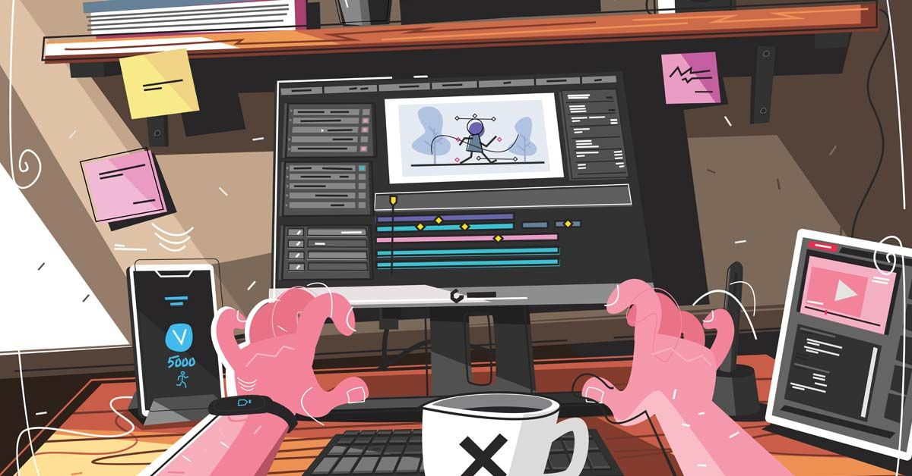

 

<h4 align="center">Hey, I'm Subrata 👋 Just Shipping Ideas, One Commit at a Time.</h4>

###

  

###

  

  

  

  

###

  
  

  
  

  
  

  
  

  

###

  

 

  

###

 

<picture>
  <source media="(prefers-color-scheme: dark)" srcset="https://raw.githubusercontent.com/subratapanda24/subratapanda24/pacman-output/pacman-contribution-graph-dark.svg">
  <source media="(prefers-color-scheme: light)" srcset="https://raw.githubusercontent.com/subratapanda24/subratapanda24/pacman-output/pacman-contribution-graph.svg">
  
</picture>

###

  

###

  

 

  

###

  

###